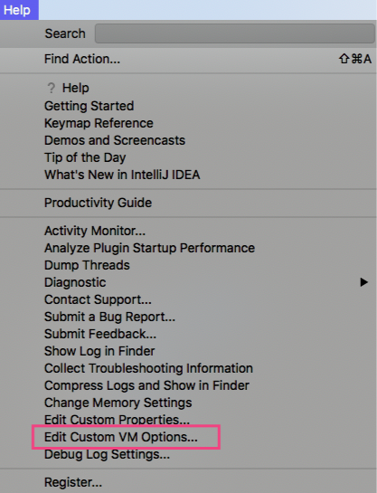
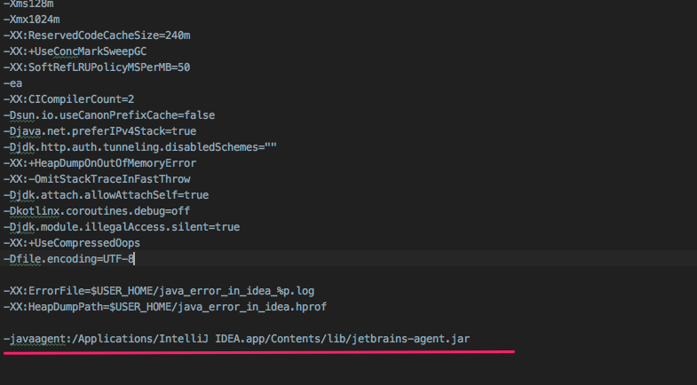
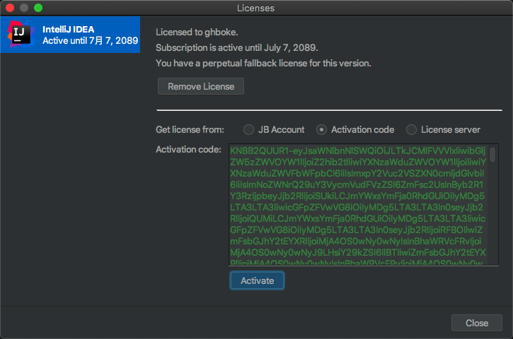

# IntelliJ IDEA / CLion

- 首先感谢前辈大人们的无私分享，本人只是搬运

下载的是 Ultimate 2019.3.1 版本 [https://www.jetbrains.com/idea/download/#section=mac]

打开 IntelliJ IDEA 后，暂时选择 30 天免费试用 Evaluate for free

- 两个 jar 包，随意用哪个都可以
- 将下载的 jar 包 放到 /Applications/IntelliJ IDEA.app/Contents/lib/ 下

- 修改 etc/hosts 文件，在文件末加入 `0.0.0.0 https://account.jetbrains.com:443` （不加入的话，激活码识别失败）

- 随意新建一个 project 
- 点击 Help - Edit Custom VM Options，如图


- 在文件末加入 `-javaagent:/Applications/IntelliJ IDEA.app/Contents/lib/jetbrains-agent.jar` ，如图


- 重启

- 点击 Help - Register，输入 激活码
- 第一个激活码
- `A82DEE284F-eyJsaWNlbnNlSWQiOiJBODJERUUyODRGIiwibGljZW5zZWVOYW1lIjoiaHR0cHM6Ly96aGlsZS5pbyIsImFzc2lnbmVlTmFtZSI6IiIsImFzc2lnbmVlRW1haWwiOiIiLCJsaWNlbnNlUmVzdHJpY3Rpb24iOiJVbmxpbWl0ZWQgbGljZW5zZSB0aWxsIGVuZCBvZiB0aGUgY2VudHVyeS4iLCJjaGVja0NvbmN1cnJlbnRVc2UiOmZhbHNlLCJwcm9kdWN0cyI6W3siY29kZSI6IklJIiwicGFpZFVwVG8iOiIyMDg5LTA3LTA3In0seyJjb2RlIjoiUlMwIiwicGFpZFVwVG8iOiIyMDg5LTA3LTA3In0seyJjb2RlIjoiV1MiLCJwYWlkVXBUbyI6IjIwODktMDctMDcifSx7ImNvZGUiOiJSRCIsInBhaWRVcFRvIjoiMjA4OS0wNy0wNyJ9LHsiY29kZSI6IlJDIiwicGFpZFVwVG8iOiIyMDg5LTA3LTA3In0seyJjb2RlIjoiREMiLCJwYWlkVXBUbyI6IjIwODktMDctMDcifSx7ImNvZGUiOiJEQiIsInBhaWRVcFRvIjoiMjA4OS0wNy0wNyJ9LHsiY29kZSI6IlJNIiwicGFpZFVwVG8iOiIyMDg5LTA3LTA3In0seyJjb2RlIjoiRE0iLCJwYWlkVXBUbyI6IjIwODktMDctMDcifSx7ImNvZGUiOiJBQyIsInBhaWRVcFRvIjoiMjA4OS0wNy0wNyJ9LHsiY29kZSI6IkRQTiIsInBhaWRVcFRvIjoiMjA4OS0wNy0wNyJ9LHsiY29kZSI6IkdPIiwicGFpZFVwVG8iOiIyMDg5LTA3LTA3In0seyJjb2RlIjoiUFMiLCJwYWlkVXBUbyI6IjIwODktMDctMDcifSx7ImNvZGUiOiJDTCIsInBhaWRVcFRvIjoiMjA4OS0wNy0wNyJ9LHsiY29kZSI6IlBDIiwicGFpZFVwVG8iOiIyMDg5LTA3LTA3In0seyJjb2RlIjoiUlNVIiwicGFpZFVwVG8iOiIyMDg5LTA3LTA3In1dLCJoYXNoIjoiODkwNzA3MC8wIiwiZ3JhY2VQZXJpb2REYXlzIjowLCJhdXRvUHJvbG9uZ2F0ZWQiOmZhbHNlLCJpc0F1dG9Qcm9sb25nYXRlZCI6ZmFsc2V9-5epo90Xs7KIIBb8ckoxnB/AZQ8Ev7rFrNqwFhBAsQYsQyhvqf1FcYdmlecFWJBHSWZU9b41kvsN4bwAHT5PiznOTmfvGv1MuOzMO0VOXZlc+edepemgpt+t3GUHvfGtzWFYeKeyCk+CLA9BqUzHRTgl2uBoIMNqh5izlDmejIwUHLl39QOyzHiTYNehnVN7GW5+QUeimTr/koVUgK8xofu59Tv8rcdiwIXwTo71LcU2z2P+T3R81fwKkt34evy7kRch4NIQUQUno//Pl3V0rInm3B2oFq9YBygPUdBUbdH/KHROyohZRD8SaZJO6kUT0BNvtDPKF4mCT1saWM38jkw==-MIIElTCCAn2gAwIBAgIBCTANBgkqhkiG9w0BAQsFADAYMRYwFAYDVQQDDA1KZXRQcm9maWxlIENBMB4XDTE4MTEwMTEyMjk0NloXDTIwMTEwMjEyMjk0NlowaDELMAkGA1UEBhMCQ1oxDjAMBgNVBAgMBU51c2xlMQ8wDQYDVQQHDAZQcmFndWUxGTAXBgNVBAoMEEpldEJyYWlucyBzLnIuby4xHTAbBgNVBAMMFHByb2QzeS1mcm9tLTIwMTgxMTAxMIIBIjANBgkqhkiG9w0BAQEFAAOCAQ8AMIIBCgKCAQEA5ndaik1GD0nyTdqkZgURQZGW+RGxCdBITPXIwpjhhaD0SXGa4XSZBEBoiPdY6XV6pOfUJeyfi9dXsY4MmT0D+sKoST3rSw96xaf9FXPvOjn4prMTdj3Ji3CyQrGWeQU2nzYqFrp1QYNLAbaViHRKuJrYHI6GCvqCbJe0LQ8qqUiVMA9wG/PQwScpNmTF9Kp2Iej+Z5OUxF33zzm+vg/nYV31HLF7fJUAplI/1nM+ZG8K+AXWgYKChtknl3sW9PCQa3a3imPL9GVToUNxc0wcuTil8mqveWcSQCHYxsIaUajWLpFzoO2AhK4mfYBSStAqEjoXRTuj17mo8Q6M2SHOcwIDAQABo4GZMIGWMAkGA1UdEwQCMAAwHQYDVR0OBBYEFGEpG9oZGcfLMGNBkY7SgHiMGgTcMEgGA1UdIwRBMD+AFKOetkhnQhI2Qb1t4Lm0oFKLl/GzoRykGjAYMRYwFAYDVQQDDA1KZXRQcm9maWxlIENBggkA0myxg7KDeeEwEwYDVR0lBAwwCgYIKwYBBQUHAwEwCwYDVR0PBAQDAgWgMA0GCSqGSIb3DQEBCwUAA4ICAQBonMu8oa3vmNAa4RQP8gPGlX3SQaA3WCRUAj6Zrlk8AesKV1YSkh5D2l+yUk6njysgzfr1bIR5xF8eup5xXc4/G7NtVYRSMvrd6rfQcHOyK5UFJLm+8utmyMIDrZOzLQuTsT8NxFpbCVCfV5wNRu4rChrCuArYVGaKbmp9ymkw1PU6+HoO5i2wU3ikTmRv8IRjrlSStyNzXpnPTwt7bja19ousk56r40SmlmC04GdDHErr0ei2UbjUua5kw71Qn9g02tL9fERI2sSRjQrvPbn9INwRWl5+k05mlKekbtbu2ev2woJFZK4WEXAd/GaAdeZZdumv8T2idDFL7cAirJwcrbfpawPeXr52oKTPnXfi0l5+g9Gnt/wfiXCrPElX6ycTR6iL3GC2VR4jTz6YatT4Ntz59/THOT7NJQhr6AyLkhhJCdkzE2cob/KouVp4ivV7Q3Fc6HX7eepHAAF/DpxwgOrg9smX6coXLgfp0b1RU2u/tUNID04rpNxTMueTtrT8WSskqvaJd3RH8r7cnRj6Y2hltkja82HlpDURDxDTRvv+krbwMr26SB/40BjpMUrDRCeKuiBahC0DCoU/4+ze1l94wVUhdkCfL0GpJrMSCDEK+XEurU18Hb7WT+ThXbkdl6VpFdHsRvqAnhR2g4b+Qzgidmuky5NUZVfEaZqV/g==`

- 第二个激活码
- `3AGXEJXFK9-eyJsaWNlbnNlSWQiOiIzQUdYRUpYRks5IiwibGljZW5zZWVOYW1lIjoiaHR0cHM6Ly96aGlsZS5pbyIsImFzc2lnbmVlTmFtZSI6IiIsImFzc2lnbmVlRW1haWwiOiIiLCJsaWNlbnNlUmVzdHJpY3Rpb24iOiIiLCJjaGVja0NvbmN1cnJlbnRVc2UiOmZhbHNlLCJwcm9kdWN0cyI6W3siY29kZSI6IklJIiwiZmFsbGJhY2tEYXRlIjoiMjA4OS0wNy0wNyIsInBhaWRVcFRvIjoiMjA4OS0wNy0wNyJ9LHsiY29kZSI6IkFDIiwiZmFsbGJhY2tEYXRlIjoiMjA4OS0wNy0wNyIsInBhaWRVcFRvIjoiMjA4OS0wNy0wNyJ9LHsiY29kZSI6IkRQTiIsImZhbGxiYWNrRGF0ZSI6IjIwODktMDctMDciLCJwYWlkVXBUbyI6IjIwODktMDctMDcifSx7ImNvZGUiOiJQUyIsImZhbGxiYWNrRGF0ZSI6IjIwODktMDctMDciLCJwYWlkVXBUbyI6IjIwODktMDctMDcifSx7ImNvZGUiOiJHTyIsImZhbGxiYWNrRGF0ZSI6IjIwODktMDctMDciLCJwYWlkVXBUbyI6IjIwODktMDctMDcifSx7ImNvZGUiOiJETSIsImZhbGxiYWNrRGF0ZSI6IjIwODktMDctMDciLCJwYWlkVXBUbyI6IjIwODktMDctMDcifSx7ImNvZGUiOiJDTCIsImZhbGxiYWNrRGF0ZSI6IjIwODktMDctMDciLCJwYWlkVXBUbyI6IjIwODktMDctMDcifSx7ImNvZGUiOiJSUzAiLCJmYWxsYmFja0RhdGUiOiIyMDg5LTA3LTA3IiwicGFpZFVwVG8iOiIyMDg5LTA3LTA3In0seyJjb2RlIjoiUkMiLCJmYWxsYmFja0RhdGUiOiIyMDg5LTA3LTA3IiwicGFpZFVwVG8iOiIyMDg5LTA3LTA3In0seyJjb2RlIjoiUkQiLCJmYWxsYmFja0RhdGUiOiIyMDg5LTA3LTA3IiwicGFpZFVwVG8iOiIyMDg5LTA3LTA3In0seyJjb2RlIjoiUEMiLCJmYWxsYmFja0RhdGUiOiIyMDg5LTA3LTA3IiwicGFpZFVwVG8iOiIyMDg5LTA3LTA3In0seyJjb2RlIjoiUk0iLCJmYWxsYmFja0RhdGUiOiIyMDg5LTA3LTA3IiwicGFpZFVwVG8iOiIyMDg5LTA3LTA3In0seyJjb2RlIjoiV1MiLCJmYWxsYmFja0RhdGUiOiIyMDg5LTA3LTA3IiwicGFpZFVwVG8iOiIyMDg5LTA3LTA3In0seyJjb2RlIjoiREIiLCJmYWxsYmFja0RhdGUiOiIyMDg5LTA3LTA3IiwicGFpZFVwVG8iOiIyMDg5LTA3LTA3In0seyJjb2RlIjoiREMiLCJmYWxsYmFja0RhdGUiOiIyMDg5LTA3LTA3IiwicGFpZFVwVG8iOiIyMDg5LTA3LTA3In0seyJjb2RlIjoiUlNVIiwiZmFsbGJhY2tEYXRlIjoiMjA4OS0wNy0wNyIsInBhaWRVcFRvIjoiMjA4OS0wNy0wNyJ9XSwiaGFzaCI6IjEyNzk2ODc3LzAiLCJncmFjZVBlcmlvZERheXMiOjcsImF1dG9Qcm9sb25nYXRlZCI6ZmFsc2UsImlzQXV0b1Byb2xvbmdhdGVkIjpmYWxzZX0=-WGTHs6XpDhr+uumvbwQPOdlxWnQwgnGaL4eRnlpGKApEEkJyYvNEuPWBSrQkPmVpim/8Sab6HV04Dw3IzkJT0yTc29sPEXBf69+7y6Jv718FaJu4MWfsAk/ZGtNIUOczUQ0iGKKnSSsfQ/3UoMv0q/yJcfvj+me5Zd/gfaisCCMUaGjB/lWIPpEPzblDtVJbRexB1MALrLCEoDv3ujcPAZ7xWb54DiZwjYhQvQ+CvpNNF2jeTku7lbm5v+BoDsdeRq7YBt9ANLUKPr2DahcaZ4gctpHZXhG96IyKx232jYq9jQrFDbQMtVr3E+GsCekMEWSD//dLT+HuZdc1sAIYrw==-MIIElTCCAn2gAwIBAgIBCTANBgkqhkiG9w0BAQsFADAYMRYwFAYDVQQDDA1KZXRQcm9maWxlIENBMB4XDTE4MTEwMTEyMjk0NloXDTIwMTEwMjEyMjk0NlowaDELMAkGA1UEBhMCQ1oxDjAMBgNVBAgMBU51c2xlMQ8wDQYDVQQHDAZQcmFndWUxGTAXBgNVBAoMEEpldEJyYWlucyBzLnIuby4xHTAbBgNVBAMMFHByb2QzeS1mcm9tLTIwMTgxMTAxMIIBIjANBgkqhkiG9w0BAQEFAAOCAQ8AMIIBCgKCAQEA5ndaik1GD0nyTdqkZgURQZGW+RGxCdBITPXIwpjhhaD0SXGa4XSZBEBoiPdY6XV6pOfUJeyfi9dXsY4MmT0D+sKoST3rSw96xaf9FXPvOjn4prMTdj3Ji3CyQrGWeQU2nzYqFrp1QYNLAbaViHRKuJrYHI6GCvqCbJe0LQ8qqUiVMA9wG/PQwScpNmTF9Kp2Iej+Z5OUxF33zzm+vg/nYV31HLF7fJUAplI/1nM+ZG8K+AXWgYKChtknl3sW9PCQa3a3imPL9GVToUNxc0wcuTil8mqveWcSQCHYxsIaUajWLpFzoO2AhK4mfYBSStAqEjoXRTuj17mo8Q6M2SHOcwIDAQABo4GZMIGWMAkGA1UdEwQCMAAwHQYDVR0OBBYEFGEpG9oZGcfLMGNBkY7SgHiMGgTcMEgGA1UdIwRBMD+AFKOetkhnQhI2Qb1t4Lm0oFKLl/GzoRykGjAYMRYwFAYDVQQDDA1KZXRQcm9maWxlIENBggkA0myxg7KDeeEwEwYDVR0lBAwwCgYIKwYBBQUHAwEwCwYDVR0PBAQDAgWgMA0GCSqGSIb3DQEBCwUAA4ICAQBonMu8oa3vmNAa4RQP8gPGlX3SQaA3WCRUAj6Zrlk8AesKV1YSkh5D2l+yUk6njysgzfr1bIR5xF8eup5xXc4/G7NtVYRSMvrd6rfQcHOyK5UFJLm+8utmyMIDrZOzLQuTsT8NxFpbCVCfV5wNRu4rChrCuArYVGaKbmp9ymkw1PU6+HoO5i2wU3ikTmRv8IRjrlSStyNzXpnPTwt7bja19ousk56r40SmlmC04GdDHErr0ei2UbjUua5kw71Qn9g02tL9fERI2sSRjQrvPbn9INwRWl5+k05mlKekbtbu2ev2woJFZK4WEXAd/GaAdeZZdumv8T2idDFL7cAirJwcrbfpawPeXr52oKTPnXfi0l5+g9Gnt/wfiXCrPElX6ycTR6iL3GC2VR4jTz6YatT4Ntz59/THOT7NJQhr6AyLkhhJCdkzE2cob/KouVp4ivV7Q3Fc6HX7eepHAAF/DpxwgOrg9smX6coXLgfp0b1RU2u/tUNID04rpNxTMueTtrT8WSskqvaJd3RH8r7cnRj6Y2hltkja82HlpDURDxDTRvv+krbwMr26SB/40BjpMUrDRCeKuiBahC0DCoU/4+ze1l94wVUhdkCfL0GpJrMSCDEK+XEurU18Hb7WT+ThXbkdl6VpFdHsRvqAnhR2g4b+Qzgidmuky5NUZVfEaZqV/g==`

- 第三个激活码
- `KNBB2QUUR1-eyJsaWNlbnNlSWQiOiJLTkJCMlFVVVIxIiwibGljZW5zZWVOYW1lIjoiZ2hib2tlIiwiYXNzaWduZWVOYW1lIjoiIiwiYXNzaWduZWVFbWFpbCI6IiIsImxpY2Vuc2VSZXN0cmljdGlvbiI6IiIsImNoZWNrQ29uY3VycmVudFVzZSI6ZmFsc2UsInByb2R1Y3RzIjpbeyJjb2RlIjoiSUkiLCJmYWxsYmFja0RhdGUiOiIyMDg5LTA3LTA3IiwicGFpZFVwVG8iOiIyMDg5LTA3LTA3In0seyJjb2RlIjoiQUMiLCJmYWxsYmFja0RhdGUiOiIyMDg5LTA3LTA3IiwicGFpZFVwVG8iOiIyMDg5LTA3LTA3In0seyJjb2RlIjoiRFBOIiwiZmFsbGJhY2tEYXRlIjoiMjA4OS0wNy0wNyIsInBhaWRVcFRvIjoiMjA4OS0wNy0wNyJ9LHsiY29kZSI6IlBTIiwiZmFsbGJhY2tEYXRlIjoiMjA4OS0wNy0wNyIsInBhaWRVcFRvIjoiMjA4OS0wNy0wNyJ9LHsiY29kZSI6IkdPIiwiZmFsbGJhY2tEYXRlIjoiMjA4OS0wNy0wNyIsInBhaWRVcFRvIjoiMjA4OS0wNy0wNyJ9LHsiY29kZSI6IkRNIiwiZmFsbGJhY2tEYXRlIjoiMjA4OS0wNy0wNyIsInBhaWRVcFRvIjoiMjA4OS0wNy0wNyJ9LHsiY29kZSI6IkNMIiwiZmFsbGJhY2tEYXRlIjoiMjA4OS0wNy0wNyIsInBhaWRVcFRvIjoiMjA4OS0wNy0wNyJ9LHsiY29kZSI6IlJTMCIsImZhbGxiYWNrRGF0ZSI6IjIwODktMDctMDciLCJwYWlkVXBUbyI6IjIwODktMDctMDcifSx7ImNvZGUiOiJSQyIsImZhbGxiYWNrRGF0ZSI6IjIwODktMDctMDciLCJwYWlkVXBUbyI6IjIwODktMDctMDcifSx7ImNvZGUiOiJSRCIsImZhbGxiYWNrRGF0ZSI6IjIwODktMDctMDciLCJwYWlkVXBUbyI6IjIwODktMDctMDcifSx7ImNvZGUiOiJQQyIsImZhbGxiYWNrRGF0ZSI6IjIwODktMDctMDciLCJwYWlkVXBUbyI6IjIwODktMDctMDcifSx7ImNvZGUiOiJSTSIsImZhbGxiYWNrRGF0ZSI6IjIwODktMDctMDciLCJwYWlkVXBUbyI6IjIwODktMDctMDcifSx7ImNvZGUiOiJXUyIsImZhbGxiYWNrRGF0ZSI6IjIwODktMDctMDciLCJwYWlkVXBUbyI6IjIwODktMDctMDcifSx7ImNvZGUiOiJEQiIsImZhbGxiYWNrRGF0ZSI6IjIwODktMDctMDciLCJwYWlkVXBUbyI6IjIwODktMDctMDcifSx7ImNvZGUiOiJEQyIsImZhbGxiYWNrRGF0ZSI6IjIwODktMDctMDciLCJwYWlkVXBUbyI6IjIwODktMDctMDcifSx7ImNvZGUiOiJSU1UiLCJmYWxsYmFja0RhdGUiOiIyMDg5LTA3LTA3IiwicGFpZFVwVG8iOiIyMDg5LTA3LTA3In1dLCJoYXNoIjoiMTI3OTY4NzcvMCIsImdyYWNlUGVyaW9kRGF5cyI6NywiYXV0b1Byb2xvbmdhdGVkIjpmYWxzZSwiaXNBdXRvUHJvbG9uZ2F0ZWQiOmZhbHNlfQ==-1iV7BA/baNqv0Q5yUnAphUmh66QhkDRX+qPL09ICuEicBqiPOBxmVLLCVUpkxhrNyfmOtat2LcHwcX/NHkYXdoW+6aS0S388xe1PV2oodiPBhFlEaOac42UQLgP4EidfGQSvKwC9tR1zL5b2CJPQKZ7iiHh/iKBQxP6OBMUP1T7j3Fe1rlxfYPc92HRZf6cO+C0+buJP5ERZkyIn5ZrVM4TEnWrRHbpL8SVNq4yqfc+NwoRzRSNC++81VDS3AXv9c91YeZJz6JXO7AokIk54wltr42FLNuKbozvB/HCxV9PA5vIiM+kZY1K0w5ytgxEYKqA87adA7R5xL/crpaMxHQ==-MIIElTCCAn2gAwIBAgIBCTANBgkqhkiG9w0BAQsFADAYMRYwFAYDVQQDDA1KZXRQcm9maWxlIENBMB4XDTE4MTEwMTEyMjk0NloXDTIwMTEwMjEyMjk0NlowaDELMAkGA1UEBhMCQ1oxDjAMBgNVBAgMBU51c2xlMQ8wDQYDVQQHDAZQcmFndWUxGTAXBgNVBAoMEEpldEJyYWlucyBzLnIuby4xHTAbBgNVBAMMFHByb2QzeS1mcm9tLTIwMTgxMTAxMIIBIjANBgkqhkiG9w0BAQEFAAOCAQ8AMIIBCgKCAQEA5ndaik1GD0nyTdqkZgURQZGW+RGxCdBITPXIwpjhhaD0SXGa4XSZBEBoiPdY6XV6pOfUJeyfi9dXsY4MmT0D+sKoST3rSw96xaf9FXPvOjn4prMTdj3Ji3CyQrGWeQU2nzYqFrp1QYNLAbaViHRKuJrYHI6GCvqCbJe0LQ8qqUiVMA9wG/PQwScpNmTF9Kp2Iej+Z5OUxF33zzm+vg/nYV31HLF7fJUAplI/1nM+ZG8K+AXWgYKChtknl3sW9PCQa3a3imPL9GVToUNxc0wcuTil8mqveWcSQCHYxsIaUajWLpFzoO2AhK4mfYBSStAqEjoXRTuj17mo8Q6M2SHOcwIDAQABo4GZMIGWMAkGA1UdEwQCMAAwHQYDVR0OBBYEFGEpG9oZGcfLMGNBkY7SgHiMGgTcMEgGA1UdIwRBMD+AFKOetkhnQhI2Qb1t4Lm0oFKLl/GzoRykGjAYMRYwFAYDVQQDDA1KZXRQcm9maWxlIENBggkA0myxg7KDeeEwEwYDVR0lBAwwCgYIKwYBBQUHAwEwCwYDVR0PBAQDAgWgMA0GCSqGSIb3DQEBCwUAA4ICAQBonMu8oa3vmNAa4RQP8gPGlX3SQaA3WCRUAj6Zrlk8AesKV1YSkh5D2l+yUk6njysgzfr1bIR5xF8eup5xXc4/G7NtVYRSMvrd6rfQcHOyK5UFJLm+8utmyMIDrZOzLQuTsT8NxFpbCVCfV5wNRu4rChrCuArYVGaKbmp9ymkw1PU6+HoO5i2wU3ikTmRv8IRjrlSStyNzXpnPTwt7bja19ousk56r40SmlmC04GdDHErr0ei2UbjUua5kw71Qn9g02tL9fERI2sSRjQrvPbn9INwRWl5+k05mlKekbtbu2ev2woJFZK4WEXAd/GaAdeZZdumv8T2idDFL7cAirJwcrbfpawPeXr52oKTPnXfi0l5+g9Gnt/wfiXCrPElX6ycTR6iL3GC2VR4jTz6YatT4Ntz59/THOT7NJQhr6AyLkhhJCdkzE2cob/KouVp4ivV7Q3Fc6HX7eepHAAF/DpxwgOrg9smX6coXLgfp0b1RU2u/tUNID04rpNxTMueTtrT8WSskqvaJd3RH8r7cnRj6Y2hltkja82HlpDURDxDTRvv+krbwMr26SB/40BjpMUrDRCeKuiBahC0DCoU/4+ze1l94wVUhdkCfL0GpJrMSCDEK+XEurU18Hb7WT+ThXbkdl6VpFdHsRvqAnhR2g4b+Qzgidmuky5NUZVfEaZqV/g==`



- 之后就 OK 了


# 新方法
- https://www.macfz.com/a/Jetbrainscrack.html
- 在Settings/Preferences... -> Plugins 内手动添加第三方插件仓库地址：https://plugins.zhile.io
- 搜索：IDE Eval Reset插件进行安装
- 或者下载 ide-eval-resetter-2.1.6.jar包
- 在Settings/Preferences... -> Plugins 里手动安装插件（Install Plugin From Disk...）

```
0x2. 如何使用

一般来说，在IDE窗口切出去或切回来时（窗口失去/得到焦点）会触发事件，检测是否长时间（25天）没有重置，给通知让你选择。（初次安装因为无法获取上次重置时间，会直接给予提示）
也可以手动唤出插件的主界面：
如果IDE没有打开项目，在Welcome界面点击菜单：Get Help -> Eval Reset
如果IDE打开了项目，点击菜单：Help -> Eval Reset
唤出的插件主界面中包含了一些显示信息，2个按钮，1个勾选项：
按钮：Reload 用来刷新界面上的显示信息。
按钮：Reset 点击会询问是否重置试用信息并重启IDE。选择Yes则执行重置操作并重启IDE生效，选择No则什么也不做。（此为手动重置方式）
勾选项：Auto reset before per restart 如果勾选了，则自勾选后每次重启/退出IDE时会自动重置试用信息，你无需做额外的事情。（此为自动重置方式）

0x3. 如何更新

1). 插件更新机制（推荐）：

IDE会自行检测其自身和所安装插件的更新并给予提示。如果本插件有更新，你会收到提示看到更新日志，自行选择是否更新。
点击IDE的Check for Updates... 菜单手动检测IDE和所安装插件的更新。如果本插件有更新，你会收到提示看到更新日志，自行选择是否更新。
插件更新可能会需要重启IDE。
2). 手动更新：

从本页面下载最新的插件zip包安装更新。参考本文：下载安装小节。
插件更新需要重启IDE。
0x4. 一些说明

本插件默认不会显示其主界面，如果你需要，参考本文：如何使用小节。
市场付费插件的试用信息也会一并重置。
对于某些付费插件（如: Iedis 2, MinBatis）来说，你可能需要去取掉javaagent配置（如果有）后重启IDE：
如果IDE没有打开项目，在Welcome界面点击菜单：Configure -> Edit Custom VM Options... -> 移除 -javaagent: 开头的行。
如果IDE打开了项目，点击菜单：Help -> Edit Custom VM Options... -> 移除 -javaagent: 开头的行。
重置需要重启IDE生效！
重置后并不弹出Licenses对话框让你选择输入License或试用，这和之前的重置脚本/插件不同（省去这烦人的一步）。
如果长达25天不曾有任何重置动作，IDE会有通知询问你是否进行重置。
如果勾选：Auto reset before per restart ，重置是静默无感知的。
简单来说：勾选了Auto reset before per restart则无需再管，一劳永逸。

0x5. 开源信息

插件是学习研究项目，源代码是开放的。源码仓库地址：https://gitee.com/pengzhile/ide-eval-resetter
如果你有更好的想法，欢迎给我提Pull Request来共同研究完善。
插件源码使用：GPL-2.0开源协议发布。
插件使用PHP编写，毕竟PHP是世界上最好的编程语言！
```
# 参考资料
- https://segmentfault.com/a/1190000021175516
- https://www.exception.site/essay/your-activation-code-could-not-be-validated-error-1653219
- 还有 两个 jar 包的提供者，我忘记他的链接了，实在不好意思。


