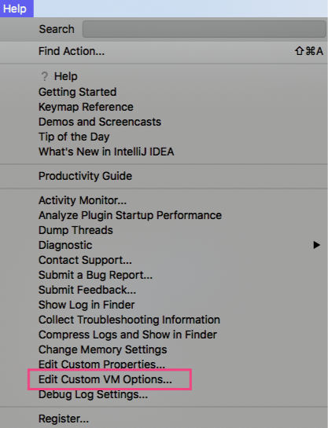

# IntelliJ IDEA

下载的是 Ultimate 2019.3.1 版本 【https://www.jetbrains.com/idea/download/#section=mac】

打开 IntelliJ IDEA 后，暂时选择 30 天免费试用 Evaluate for free

- 两个 jar 包，随意用哪个都可以
- 将下载的 jar 包 放到 /Applications/IntelliJ IDEA.app/Contents/lib/ 下

- 随意新建一个 project 
- 点击 Help - Edit Custom VM Options，如图

