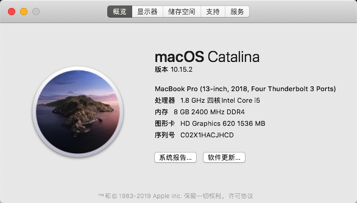

# Mac

## 终端配色设置
- [大佬的帖子里的问答链接中有vim的配置](https://zhuanlan.zhihu.com/p/60880207)
- `vim ~/.zshrc`
```text
export CLICOLOR=1
export LSCOLORS=ExGxFxdaCxDaDahbadeche

autoload -U colors && colors
PROMPT="%{$fg_bold[cyan]%}%n%{$reset_color%}@%{$fg_bold[cyan]%}%m %{$fg_bold[green]%}%1~ %{$reset_color%}%#"

```
- `vim ~/.vimrc`
```text
syntax on	" 自动语法高亮
set number " 显示行号
set cindent
set smartindent " 开启新行时使用智能自动缩进
set showmatch " 插入括号时，短暂地跳转到匹配的对应括号
set ruler " 打开状态栏标尺
:set mouse=a "在vim所有模式下开鼠标，复制文档就可以不包含行号了

```

 首先感谢前辈大佬的无私分享，特别是 黑果小兵大佬 和 johnnync13 大佬。
- sudo spctl --master-disable
# 杂谈
- 个人偏爱 Mac，所以就把 小米笔记本 Air 13.3 I5-8250U 集显版 只装了 Mac。
- 买了电脑后，先把硬盘三星 pm981 换成了 三星 pm961.

# 前期准备
- Mac 镜像 [https://mirrors.dtops.cc/iso/MacOS/daliansky_macos/]
- EFI 文件夹 [https://github.com/johnnync13/Xiaomi-Mi-Air]
- WEPE.exe [http://www.wepe.com.cn/download.html]
- Etcher.exe [https://www.balena.io/etcher/]
- 大于 8G 的 U盘 
- WiFi USB 硬件和驱动 [https://github.com/chris1111/Wireless-USB-Adapter]
- Kext Utility
- one-key-hidpi [https://github.com/xzhih/one-key-hidpi]

# 注意事项
- 务必备份数据，接下来的操作会清除所有的数据

# 杂说
- 用 WEPE.exe 制作 PE，方便后期维护电脑
- 用 Etcher.exe 烧录 Mac 镜像到 U盘
- 可按照 黑果小兵的教程进行之后的操作 [https://blog.daliansky.net/MacOS-installation-tutorial-XiaoMi-Pro-installation-process-records.html]
- Mac 安装完成后，EFI 合并后，使用 Kext Utility，之后重启电脑
- 插入 WiFi USB，安装驱动，连接到 WI-FI，便可以上网了
- 开启次像素抗锯齿，在终端运行 `defaults write -g CGFontRenderingFontSmoothingDisabled -bool NO`
- 破解 App 来源限制，在终端运行 `sudo spctl --master-disable`
- 设置 hidpi



# zshrc
- `vim ~/.zshrc`
- `source ~/.zshrc`

# 终端 ssh 自动断开链接
- 修改 `vim ~/.ssh/config` 添加 `ServerAliveInterval 30`


